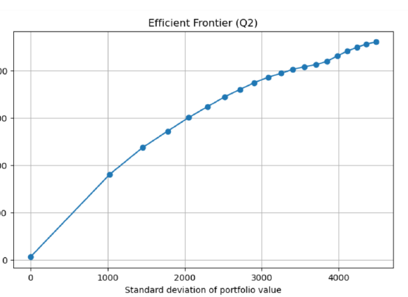
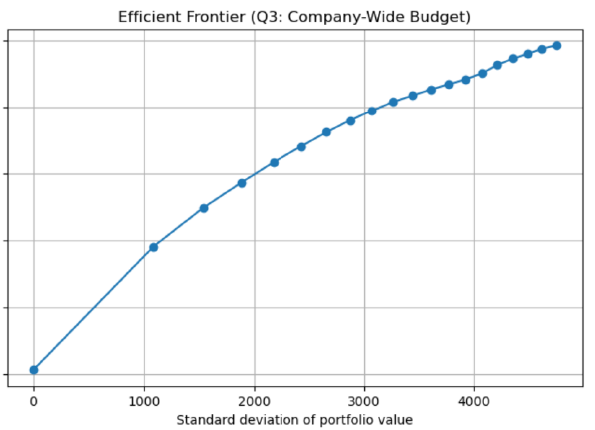
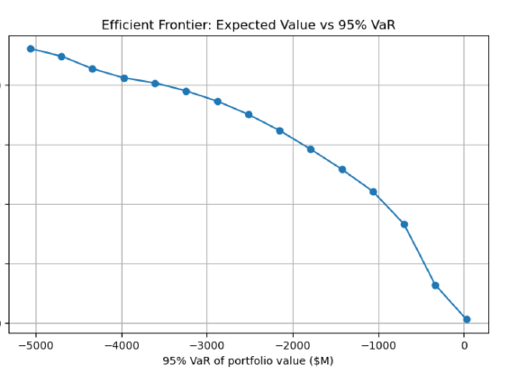

# Drug Development Portfolio Optimization with Gurobi

**Pharmaceutical R&D Portfolio Strategy · Mixed-Integer Optimization · Efficient Frontiers · Variance · 95% VaR**

This portfolio project analyzes how a pharmaceutical company can allocate a **$1.0B drug-development budget** across 114 candidate projects while balancing expected value, pipeline composition, therapeutic-area budgets, portfolio variance, and extreme downside risk.

The project was adapted from a graduate optimization submission into a recruiter-facing GitHub case study. The original submission contains the mathematical formulations, full Python/Gurobi code, solver outputs, and efficient-frontier graphs; this repository reorganizes that work into clean notebooks, reusable scripts, result tables, and portfolio documentation.

## Business questions

The analysis answers four progressively harder portfolio-management questions:

1. **Risk-neutral allocation:** Which drug projects maximize total expected portfolio value under therapeutic-area budgets and pipeline constraints?
2. **Variance control:** How much expected value must be sacrificed to reduce portfolio variance?
3. **Budget flexibility:** What changes if the company pools the full budget instead of using therapeutic-area silos?
4. **Extreme-risk management:** How does a 95% VaR requirement change the portfolio?

## Key results

| Model | Projects | Spend ($M) | Unused ($M) | Expected value ($M) | Std. dev. ($M) | 95% VaR ($M) |
|---|---:|---:|---:|---:|---:|---:|
| Q1 - Therapeutic-area risk-neutral | 46 | 874.48 | 125.52 | 2,305.09 | 4,480.67 | -5,065.62 |
| Q2 - Variance cap 20,000,000 | 46 | 873.43 | 126.57 | 2,303.27 | 4,470.62 | - |
| Q3 - Company-wide risk-neutral | 53 | 986.95 | 13.05 | **2,466.60** | 4,742.26 | - |
| Q4 - Maximum-VaR / all-cash | 0 | 0.00 | 1,000.00 | 30.00 | 0.00 | 30.00 |

### Q1 - Risk-neutral portfolio

The therapeutic-area model selects **46 projects**, spends **$874.48M**, and achieves total expected portfolio value of **$2,305.09M**. The selected pipeline satisfies all time-to-market mix constraints.

### Q2 - Variance-constrained portfolio

A representative variance cap of **20,000,000** reduces standard deviation from **$4,480.67M to $4,470.62M** while reducing expected value by only about **$1.82M**.



The source frontier shows diminishing gains near the high-risk end: most attainable expected value can be captured before reaching the maximum-risk portfolio.

### Q3 - Company-wide budget

Pooling the full $1.0B budget increases the selected portfolio to **53 projects**, raises budget utilization to **98.69%**, and increases expected value to **$2,466.60M**.

Compared with Q1, the company-wide solution adds:
- **7 projects**
- **$161.52M expected value**
- **11.24 percentage points of budget utilization**

The tradeoff is higher risk: standard deviation rises to **$4,742.26M**.



### Q4 - 95% VaR

The Q1 risk-neutral portfolio has 95% VaR of **-$5,065.62M**, revealing substantial extreme downside exposure despite its high expected value.

A strict `VaR >= 0` requirement collapses the solution to an **all-cash portfolio** with expected value of only **$30M**, showing that zero-loss protection is excessively conservative for this project set.



## Strategic recommendation

The strongest source recommendation is to move toward **company-wide budgeting** because it materially improves expected value and capital utilization, but pair that flexibility with explicit portfolio-risk controls.

The broader decision-science lesson is that the best pharmaceutical R&D portfolio is not simply the set of projects with the highest individual eNPVs. The optimizer must simultaneously account for:
- capital constraints,
- therapeutic-area allocation,
- development timing,
- project covariance,
- expected portfolio value,
- total volatility,
- and extreme downside exposure.

## Repository structure

```text
drug-development-portfolio-optimization/
├── README.md
├── notebooks/
│   ├── 01_q1_risk_neutral.ipynb
│   ├── 02_q2_variance_frontier.ipynb
│   ├── 03_q3_companywide_budget.ipynb
│   └── 04_q4_var_frontier.ipynb
├── src/
│   ├── common.py
│   ├── q1_risk_neutral.py
│   ├── q2_variance_frontier.py
│   ├── q3_companywide_budget.py
│   └── q4_var_frontier.py
├── images/
│   ├── efficient_frontier_q2.png
│   ├── efficient_frontier_q3.png
│   └── efficient_frontier_q4_var.png
├── results/
│   ├── summary_metrics.csv
│   ├── q1_selected_projects.csv
│   ├── q1_pipeline_mix.csv
│   ├── q2_representative_selected_projects.csv
│   └── q3_selected_projects.csv
├── reports/
│   └── portfolio_summary.md
├── data/
│   └── README.md
├── requirements.txt
└── .gitignore
```

## Data setup

The source assignment uses two CSV files:

- `drugs.csv`
- `drugs_cov.csv`

They are **not included in this repository** because they were not part of the provided submission report.

Place them in `data/` before rerunning the notebooks.

## Run locally

Gurobi requires a valid installation and license.

```bash
git clone https://github.com/FranbonAhmed/drug-development-portfolio-optimization.git
cd drug-development-portfolio-optimization

python -m venv .venv
pip install -r requirements.txt
jupyter notebook
```

Open the notebooks in numerical order.

## Technical stack

**Python · Gurobi · pandas · NumPy · Matplotlib · Mixed-Integer Programming · Quadratic Constraints · Efficient Frontier Analysis · Portfolio Variance · Value at Risk**

## Portfolio positioning

This project demonstrates the connection between **pharmaceutical strategy, finance, risk management, and optimization**. It is designed as a portfolio case study rather than a reproduction of the original assignment document.
